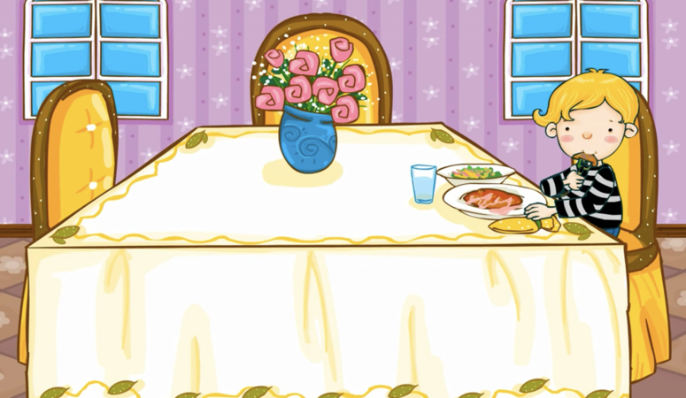

### 這是我睡覺的房間。
> Voici la chambre où je dors.

### 我在臥室裏睡覺。
> Je dors dans la chambre à coucher.

### 這是我洗澡的地方。
> Voici l'endroit où je prends ma douche.

### 我在洗手間裏洗澡。
> Je prends ma douche dans la salle de bains.

### 這是我做飯的地方。
> Voici l'endroit où je cuisine.

### 我在廚房裏做飯。
> Je cuisine dans la cuisine.

### 這是我吃飯的地方。
> Voici l'endroit où je mange. 

### 我在餐廳裏吃飯。
> Je mange dans la salle à manger.

### 這是我跟爸爸交談的地方。
>  C'est l'endroit où je discute avec mon papa.

### 我跟爸爸在客廳裏說話。
> Je discute avec mon père dans le salon.

### 這是我們停車的地方。
> Voici l'endroit où nous garons notre voiture.

### 我們把車停在車庫裏。
> Nous garons la voiture dans le garage.

### 這是我玩兒的地方。 
> Voici l'endroit où je joue.

### 我在院子裏玩兒。
> Je joue dans le jardin. 

### 這是我的家。我和爸爸媽媽住在一起
> Voici ma maison. Je vis ici avec mon père et ma mère. 

### “溫暖的家！”
> Une "maison chaleureuse !"
