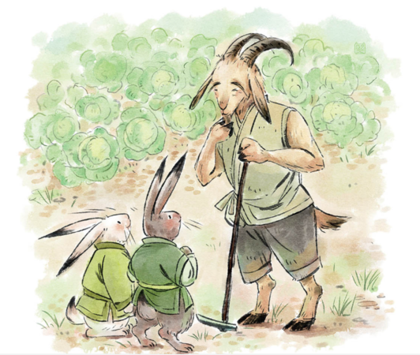
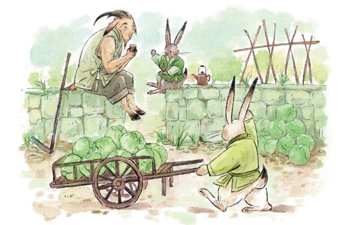
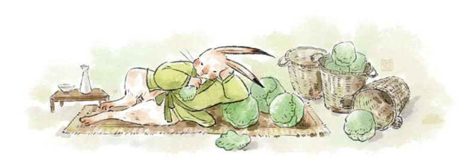

### 小白兔和小灰兔是最好的朋友。
> Le petit lapin blanc et le petit lapin gris sont les meilleurs amis du monde. 

### 有一天， 他們倆在外頭玩耍，小白兔看見旁邊的一個菜園子裡長著綠油油的白菜，就想跳過去吃上幾口。
> Un jour, alors qu'ils jouaient dehors, le petit lapin blanc vit un jardin avec des choux verts luxuriants et voulut sauter par-dessus pour en prendre une bouchée. 

### 小灰兔馬上跳到小白兔面前，不讓它過去，並大聲的說："你不應該去吃那些白菜！那是老山羊的菜園子。
> Le petit lapin gris sauta devant lui et dit tout haut : "Tu ne devrais pas manger ces choux ! C'est le potager du vieux bouc. 

### 再說了，白菜還很小呢！不過， 我有個主意，等白菜長大了，我們來幫老山羊收白菜吧。
> En plus, les choux sont encore petits ! Mais j'ai une idée : quand les choux seront assez gros, aidons le vieux bouc à les ramasser. 

### 他肯定會獎勵咱們一些白菜的。
> Il nous récompensera certainement avec des choux.

### 這時候，小白兔看見老山羊在菜園子裡鋤草， 他們倆就跑過去跟老山羊聊了起來。
> Le petit lapin blanc vit le vieux bouc en train de biner dans le potager et tous deux coururent lui parler. 

### "你們要來幫我收白菜，那可太好了！
> "C'est super que tu viennes m'aider pour la récolte des choux !" 

### "老山羊高興的說："今年的白菜一定會大豐收！要是你們到時候來幫我， 我就給你們倆每人一車白菜。
> Le vieux bouc répondit joyeusement : "La récolte des choux sera formidable cette année ! Si vous venez m'aider, je vous donnerai à tous les deux un chargement de choux. 

### 你們下個星期來吧！"
> Vous pourrez venir la semaine prochaine !"

### 一個星期後，小白兔和小灰兔去幫老山羊收白菜了。
> Une semaine plus tard, le petit lapin blanc et le petit lapin gris allèrent aider le vieux bouc à ramasser les choux. 

### 他們一起從早幹到晚，勞動了一整天，收了滿滿20車白菜。
> Ils travaillèrent ensemble du matin au soir et ramassèrent 20 charrettes pleines de choux. 

### 老山羊照先前答應的， 告訴兩只小兔每人可以得到一車白菜。
> Le vieux bouc dit aux deux jeunes lapins qu'ils auraient chacun un chargement de choux, comme il l'avait promis. 

### 小白兔很快裝好了一車白菜以後， 就跟老山羊說："謝謝老山羊！我把白菜送回家就把車還回來哈！"
> Lorsque le petit lapin eut fini de charger le chariot de choux, il dit au vieux bouc : "Merci, vieux bouc ! Je rendrai le chariot en rentrant à la maison."

### 小灰兔跟老山羊一邊等小白兔送車回來一邊閒聊著。
> Le petit lapin gris et le vieux bouc discutaient en attendant que le lapin blanc ne rende le chariot. 

### 老山羊把種白菜的方法都告訴了小灰兔。
> Le vieux bouc raconta au petit lapin gris comment faire pousser des choux. 

### 小灰兔聽著聽著， 突然有了個新主意，就跟老山羊說："老山羊，我不想白菜了， 給我一些白菜種子怎麼樣？
> En écoutant, il eut soudain une nouvelle idée et dit au vieux bouc : "Vieux bouc, je ne veux plus de choux, pourquoi ne pas me donner des graines de choux ?" 

### "老山羊有點驚訝，但還是很高興地給了小灰兔一包種子， 也給了他幾棵白菜。
> Le vieux bouc était un peu surpris, mais était heureux de donner au petit lapin un paquet de graines et quelques choux. 

### 小灰兔一回家就忙活起來了， 先把種菜的家伙拿出來， 然後開始松土，把白菜種子種了下去。
> Dès son retour à la maison, le petit lapin gris se mit au travail, sortant d'abord le kit de plantation, puis ameublissant la terre et plantant les graines de choux. 

### 從那天開始，小灰兔每天照看自己的菜園子，澆水，施肥， 鋤草， 殺蟲。
> À partir de ce jour, le petit lapin gris s'occupa de son jardin tous les jours, arrosant, fertilisant, binant et tuant les insectes. 

### 一個月以後， 白菜就長大了， 可以收穫了。
> Un mois plus tard, les choux étaient assez gros pour être récoltés.

### 小白兔呢， 每天只知道玩兒，肚子餓的時候就吃老山羊送的白菜。
> Le petit lapin blanc, qui ne faisait que jouer tous les jours, mangeait les choux que le Vieux bouc lui avait donnés quand il avait faim. 

### 沒過多久，白菜吃完了， 小白兔就再去找老山羊， 想要更多的白菜。
> Quand il n'avait plus de choux, il retournait chez le Vieux bouc et demandait plus de choux. 

### 小白兔到了老山羊家， 看見小灰兔推著一車白菜去送給老山羊， 就覺得很奇怪。
> Lorsque le petit lapin blanc arriva à la maison du Vieux bouc, il vit le petit lapin gris qui poussait un chariot de choux vers le Vieux bouc et fut surpris. 

### 小白兔問好朋友： "嘿， 朋友， 這些白菜是哪兒來的？"
> Le petit lapin blanc demanda à son ami : "Hé, l'ami, d'où viennent ces choux ?".

### 小灰兔說："我自己種的呀！只有自己勞動， 才會有吃不完的白菜！" 
> Le petit lapin gris dit : "Je les ai cultivés moi-même ! Ce n'est qu'en travaillant soi-même qu'on aura plus de choux et qu'on pourra en manger autant qu'on veut !" 

### 小白兔聽了有點生氣，後來想了想，就有點害羞的說："朋友， 你說的很有道理， 謝謝你。"
> Le lapin blanc était un peu en colère, mais après avoir réfléchi, il a dit d'un air penaud : "Tu as raison, mon ami, merci."

### 聽了小白兔的話，小灰兔說："過一會你跟我一起回家吧， 我也給你幾棵白菜和一些種子。
> En entendant ce que disait le petit lapin blanc, le petit lapin gris dit : "Viens à la maison avec moi plus tard et je te donnerai quelques choux et quelques graines aussi. 

### 好朋友就要互相幫助啊！"
> Les bons amis doivent s'entraider."
