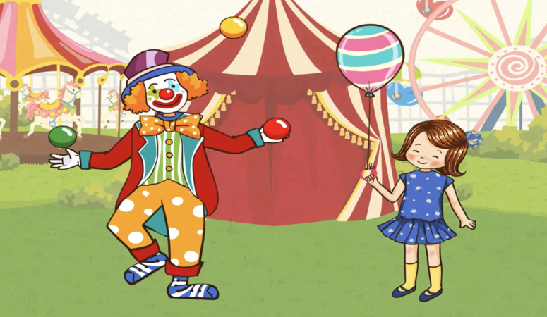
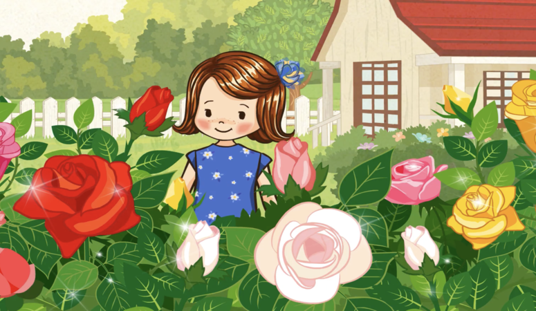
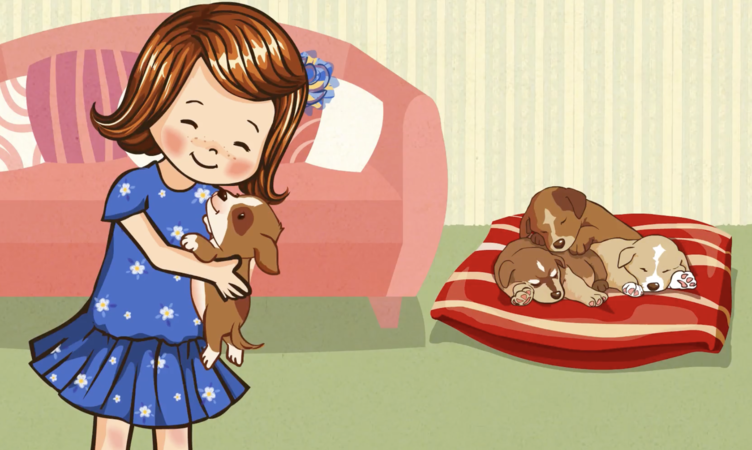
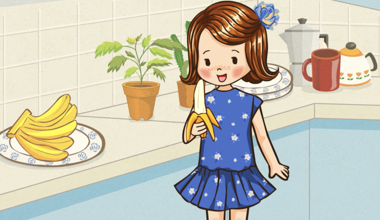
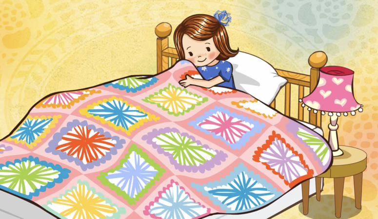
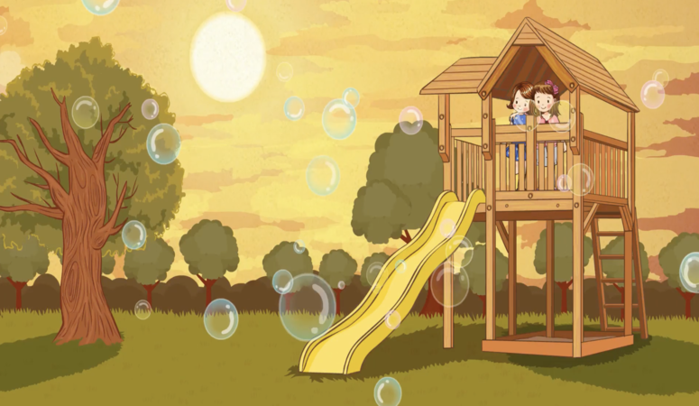

### 我喜歡小丑，因為小丑很搞笑。
> Wǒ xǐhuan xiǎochǒu, yīnwèi xiǎochǒu hěn gǎoxiào.

> J'aime les clowns parce qu'ils sont drôles.

### 我喜歡玫瑰，因为玫瑰很美麗。
> Wǒ xǐhuan méigui, yīnwèi méigui hěn měilì.

> J'aime les roses parce qu'elles sont belles.

### 我喜歡海灘，因為海灘很好玩兒。
> Wǒ xǐhuan hǎitān, yīnwèi hǎitān hěn hǎowánr.

> J'aime la plage parce que c'est amusant.

### 我喜歡小狗，因為小狗很可愛。
> Wǒ xǐhuan xiǎogǒu, yīnwèi xiǎogǒu hěn kě'ài.

> J'aime les chiens parce qu'ils sont mignons.

### 我喜歡香蕉，因為香蕉很好吃。
> Wǒ xǐhuan xiāngjiāo, yīnwèi xiāngjiāo hěn hǎochī.

> J'aime les bananes parce qu'ils sont bons.

### 我喜歡毯子，因為毯子很暖和。
> Wǒ xǐhuan tǎnzi, yīnwèi tǎnzi hěn nuǎnhuo.

> J'aime les couvertures parce qu'elles tiennent au chaud.

### 我喜歡爺爺，因為爺爺很幽默。
> Wǒ xǐhuan yéye, yīnwèi yéye hěn yōumò.

> J'aime grand-père parce qu'il est drôle.

`

### 我喜歡朋友，因為朋友很善良。
> Wǒ xǐhuan péngyou, yīnwèi péngyou hěn shànliáng.

> J'aime les amis parce qu'ils sont gentils.