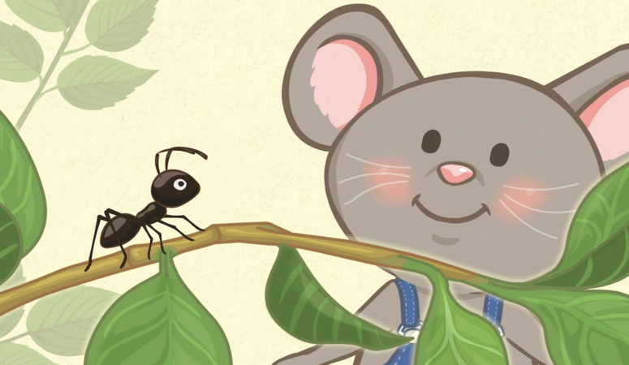
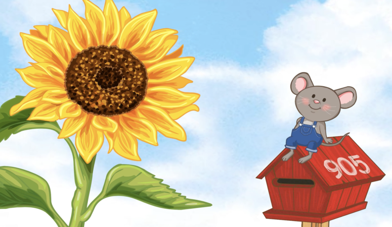
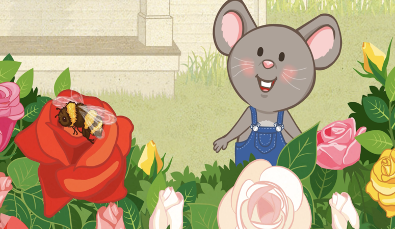

### 我看到石頭。
> Wǒ kàndào shítou.

> Je vois un rocher.

### 我看到螞蟻。
> Wǒ kàndào mǎyǐ.

> Je vois une fourmi.

### 我看到花。
> Wǒ kàndào huā.

> Je vois une fleur.

### 我看到蝴蝶。
> Wǒ kàndào húdié.

> Je vois un papillon.

### 我看到蜜蜂。
> Wǒ kàndào mìfēng.

> Je vois une abeille.

###  我看到樹。
> Wǒ kàndào shù.

> Je vois un arbre.

### 我看到貓。
> Wǒ kàndào māo.

> Je vois un chat.

### 啊，快跑！
> Ā, kuài pǎo!

> Ah sauf qui peut !
