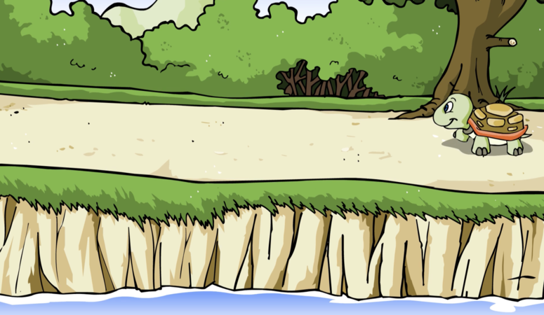
### 每天，烏龜都會沿着湖邊散步。
> Chaque jour, la tortue se promène autour du lac.

### 他很喜歡散步。
> Elle aime beaucoup se promener.

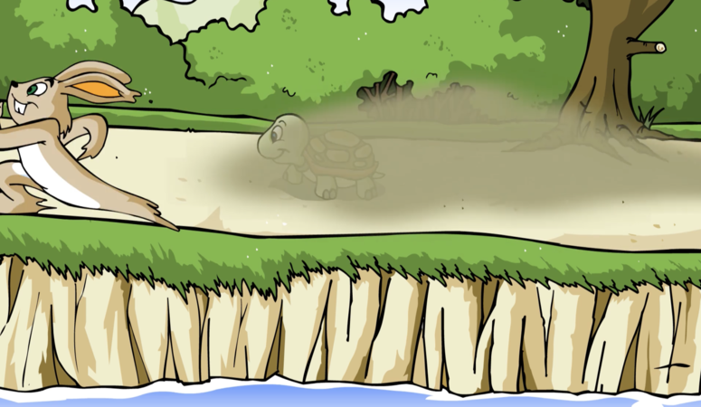

### 一天在散步的時候，他聽到一陣像風一樣的聲音。一隻兔子飛快地跑了過去。烏龜因此摔倒仰天躺了下來。
> Un jour pendant sa promenade, elle entend un bruit comme du vent. Un lapin court près de la tortue et le fait tomber.

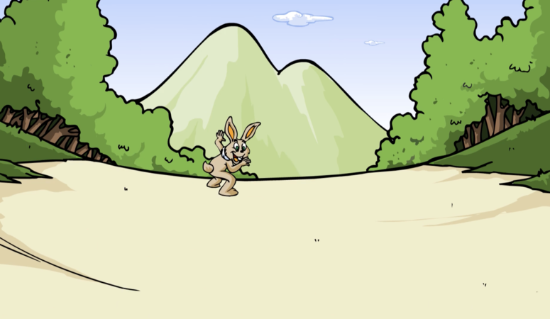

### 哈哈！你在這兒幹什麼？” 兔子嘲笑道。
> Ha-ha ! Que faites-vous ici ? Taquina le lièvre.

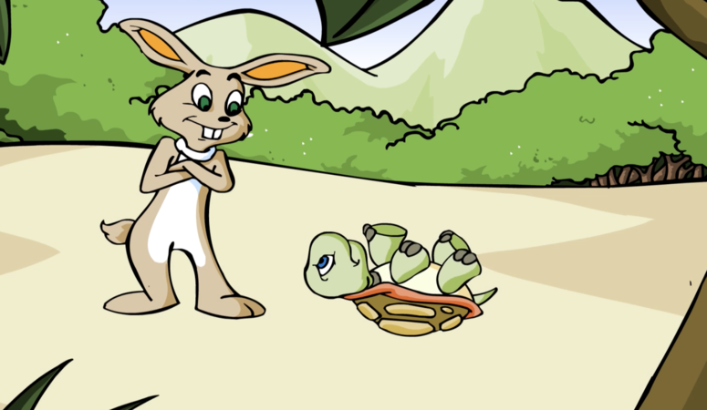

### “你應該注意路上的其他人。” 烏龜責備道。
> Vous devriez faire attention aux autres sur la route, lui rétorqua la tortue.

### “慢吞吞的人不應該擋在路上。” 兔子說。
> "Les gens qui marchent lentement ne devraient pas être sur la route", lui répondit le lièvre.

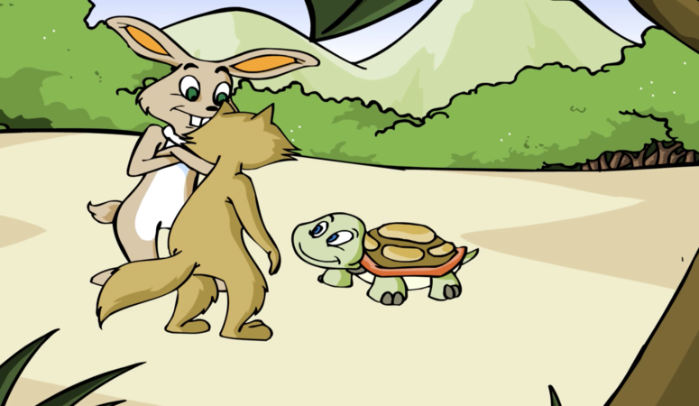

###  一隻狐狸經過了。他幫烏龜翻了過來。

> Un renard passa par ici. Il aida la tortue à se retourner. 

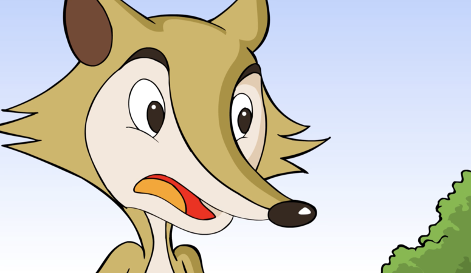

###  “你們兩個在聊什麼？” 狐狸問。
> De quoi parlez-vous tous les deux ? Demanda le renard. 

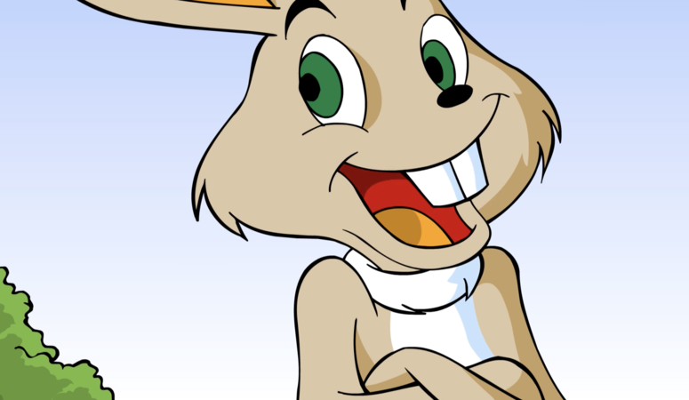

###  “我覺得慢吞吞的人不應該在路上走。
> "Je pense que les gens qui marchent lentement ne devraient pas utiliser la route. 

### 你不同意嗎，狐狸？” 兔子問。 
> N'est-ce pas Monsieur Renard ?

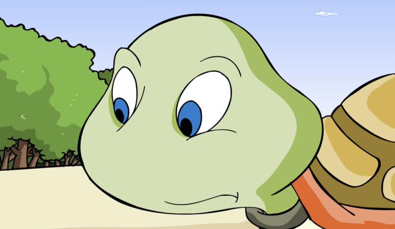

###  “這條路每個人都可以走。” 狐狸說。
> "La route est pour tout le monde", dit le renard.

###  “我來告訴你。” 兔子挑釁道，“我們來比賽吧。贏的人決定誰可以走這條路，誰不能走這條路。”
> "Je propose une idée", proposa le lapin.  Faisons une course. Le gagnant décide qui peut marcher sur la route et qui ne peut pas."

###  “好的。” 烏龜同意道，“我們比賽吧！” 
> "OK", dit la tortue. "Faisons une course !"

###  他們決定從森林的一邊跑到另一邊。狐狸同意做裁判。
> Ils décidèrent de faire la course de l'autre côté de la forêt. Le renard accepta d'être le juge de la course.

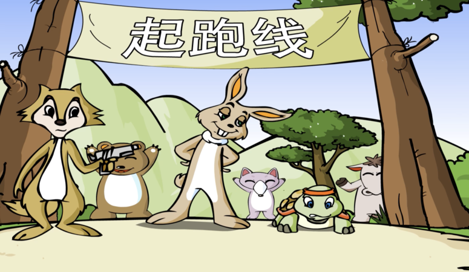
###  第二天，所有的動物都聚在一起，觀看比賽。

> Le jour suivant, tous les animaux se réunissaient en foule pour regarder la course.

### “現在取消比賽還來得及。” 
> Il est trop tard pour arrêter la course", murmura le lièvre à la tortue.  

### 兔子小聲對烏龜說，“誰會贏，很明顯。” 
> C'est évident que je vais gagner."

###  “各就位，預備，跑！” 狐狸喊道。
> "A vos marques, prêts ? Partez !", s'écria le renard.

###  兔子跑到了烏龜的前面，然後他跑了回來。“你怎麼還在這兒？” 他嘲笑道，“這樣比賽要多久啊。” 他嘆了口氣。
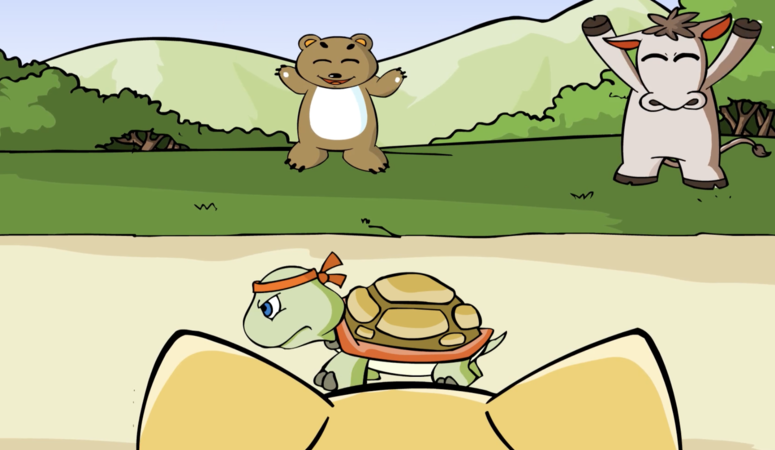
> Le lièvre court devant la tortue. Alors il revient en courant. "êtes-vous toujours là ? ", taquina-t-il. Cette course va prendre une éternité", soupira-t-il.

### 跑了一小會兒，兔子看了看後面，但是沒有烏龜的影子。於是他停了下來，看了看四周。他看到路邊有一些胡蘿蔔。
> Après avoir couru pendant un moment, le lièvre regarda derrière lui et ne vit plus la tortue. Il s'arrêta donc et regarda aux alentours. Il remarqua quelques carottes sur le côté de la route.

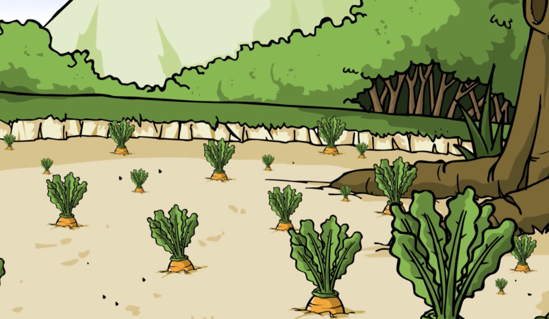

###  “噢，我的最愛！” 兔子說。
> "Oh mes préférées !" dit le lièvre.

###  烏龜雙眼盯着前方。 
> La tortue garda les yeux sur la route.

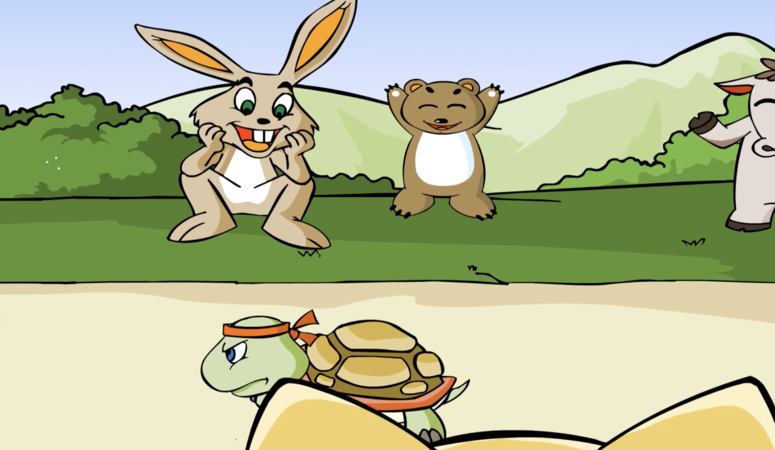

###  “加油，烏龜！你能行！” 動物們鼓勵道。
> "Allez la tortue ! Vous pouvez le faire !" encouragèrent les autres animaux. 

###  兔子吃了很多胡蘿蔔。
> Le lièvre mangeait beaucoup de carottes. 

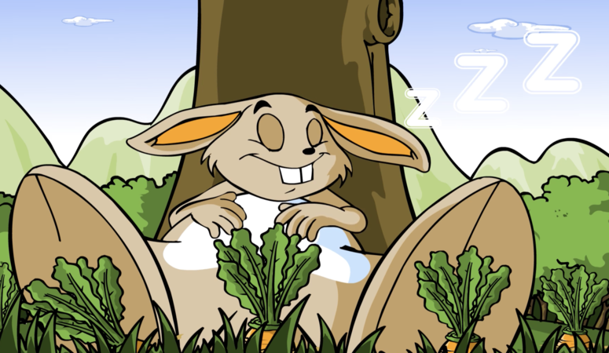

###  “哦，我飽了。” 他說，“我要睡一小會兒。烏龜還遠遠地在後面呢。” 
> "Oh, je suis plein", gémissait-il. "Je vais faire une petite sieste. La tortue est encore loin derrière moi."

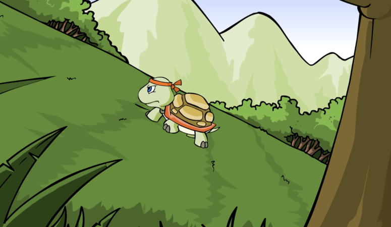

###  與此同時，烏龜堅定不移地走着。他永遠都不會放棄。他永遠都不會停下。
> Pendant ce temps, la tortue continue de marcher régulièrement. Il ne s'est jamais arrêté ni abandonné. 

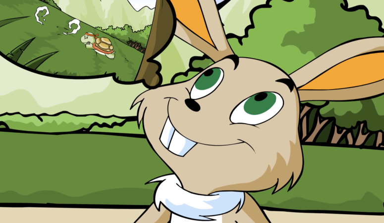
###  一段時間之後，兔子從睡夢中醒來。他覺得自己還處於領先位置。
> Quelques instants plus tard, le lièvre se réveilla de sa sieste. Il pensait qu'il était encore bien loin. Il commençait à sauter, trottiner, sauter et danser. 

### 他又蹦又跳。當快要到達終點的時候，他不敢相信自己的眼睛！
> Lorsqu'il s'approche de la ligne d'arrivée, il n'en croyait pas ses yeux !

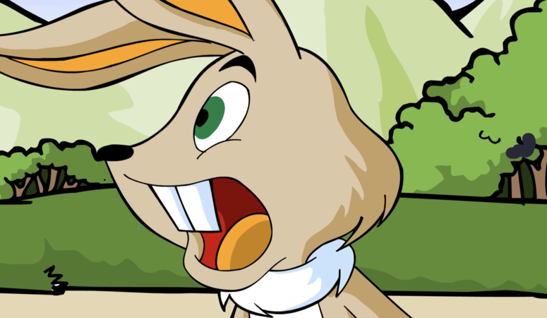

### 烏龜已經遠遠地領先在前！
> La tortue était déjà bien loin ! 

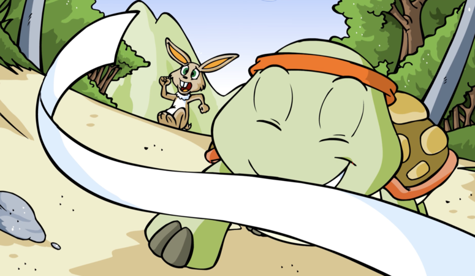

###  “不可能！” 兔子大喊。他飛快地跑着，但是追不上烏龜。
> "C'est impossible !" pleura le lièvre. Il courut aussi vite qu'il le pouvait, mais ne parvint pas à le rattraper.

###  烏龜跨過了終點線。他贏得了比賽！
> La tortue franchit la ligne d'arrivée. Il remporte la course !

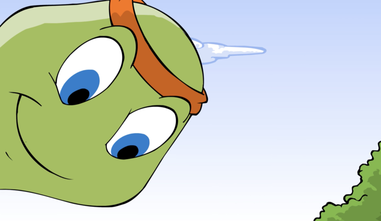

###  烏龜看着兔子說道： “雖然慢，但是我堅定不移。所以我贏得了比賽。”
> La tortue regarda le lièvre et lui dit : "Je suis lent, mais régulier, c'est pour ça que j'ai remporté la course".

