### 很久以前，森林裏有個美麗的池塘。青蛙們在那裏快樂地生活。
> Il était une fois un bel étang dans la forêt. Les grenouilles y vivaient heureuses.

### “多麼愜意的生活！在這兒我們擁有想要的一切。” 大家都很贊同。
> "Quelle vie agréable ! Nous avons tout ce que nous voulons ici", disaient-elles.

### “但是我們沒有國王。” 一隻青蛙說。
> "Mais nous n'avons pas de roi", dit une grenouille. 

### “森林裏的其他動物們都有自己的國王。”
> "Les autres animaux de la forêt ont tous leur propre roi."

### “是的，其他所有的動物都爲自己的國王感到驕傲。” 另一隻青蛙說。
> "Oui, les autres animaux sont tous fiers de leurs rois", dit une autre grenouille.

### “他們可能會因爲我們沒有國王欺負我們。”
> "Ils pourraient se moquer de nous parce que nous n'avons pas de roi".

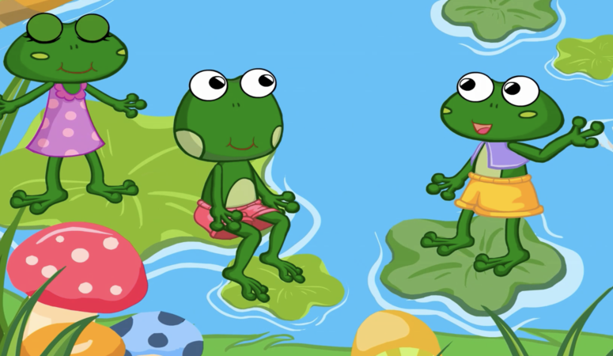

### “讓我們去找森林之神要一個國王吧。” 一隻青蛙建議道。
> "Allons trouver le Dieu de la forêt et demandons un roi", a suggéré une grenouille."

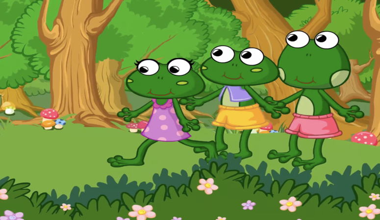

### 於是青蛙們來到森林之神面前。
> Alors les grenouilles s'approchèrent du Dieu de la Forêt.

### “森林之神，你能幫幫我們嗎？” 
> "Dieu de la forêt, peux-tu nous aider ?"

### “怎麼了？” 
> "Qu'est-ce qu'il y a ?"

### “我們想要一個國王。” 
> "Nous voulons avoir un roi."

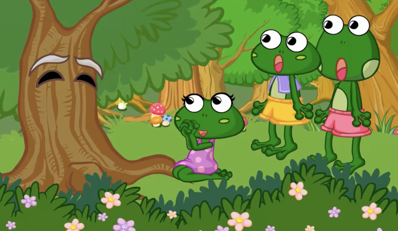

### “你們現在自由快樂。爲什麼想要一個國王？” 森林之神問。
> "Vous êtes libres et heureux maintenant. Pourquoi souhaitez-vous un roi ?" demanda le Dieu de la forêt.

### 青蛙們做出瞭解釋。“森林裏的其他動物都有一個國王，只有我們沒有。
> Les grenouilles s'expliquèrent. "Les autres animaux ont tous un roi. Nous sommes les seuls à ne pas en avoir."

### 他們可能會嘲笑我們。
> "Ils pourraient se moquer de nous."

### 森林之神，請給我們一個國王吧。” 青蛙們說。
> "Dieu de la forêt, donne-nous un roi," dirent les grenouilles.

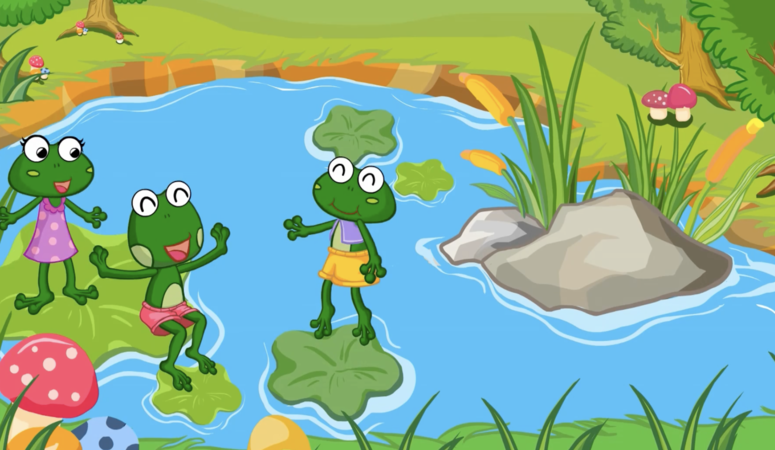

### “你們應該爲你們擁有的感到慶幸。” 森林之神說。
> "Vous devriez être heureux de ce que vous avez", dit le Dieu de la forêt. 

### “不過既然你們堅持，我就滿足你們的願望。” 
> "Mais puisque vous insistez, je vais exaucer votre souhait."

### 快樂的青蛙們回到家等待自己的國王。
> Les grenouilles heureuses rentrèrent chez elles pour attendre leur roi. 

### 突然，一根樹幹從天而降。噗咚！
> Soudain, une bûche tomba du ciel. Splash !

### “快跑，有東西在攻擊我們！” 青蛙們哭喊着潛入池塘底部。
> "Cours ! Quelque chose nous attaque !" crièrent les grenouilles, et elles plongèrent au fond de l'étang.

### 過了一會兒，池塘恢復了平靜。“哦，這一定是我們的國王。” 一隻青蛙說。
> Après un moment, l'étang était à nouveau calme. "Oh, ça doit être notre roi", dit l'une des grenouilles.

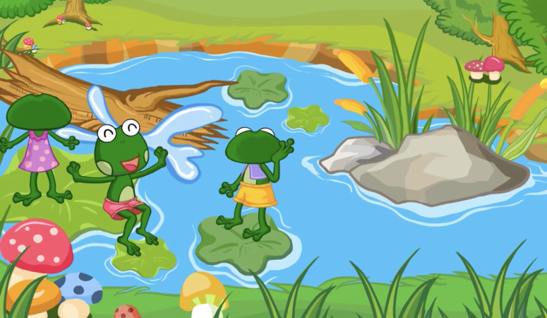

### “是的，我們的國王來了。讓我們向他致敬。” 但是青蛙們發現他們的國王一動不動。
> "Oui, notre roi est arrivé. Allons lui présenter nos respects". Mais les grenouilles constatèrent que leur roi ne bougeait pas du tout.

### “這只是一根木頭罷了！” 一隻青蛙說。
> "Ce n'est rien qu'une bûche !" dit une grenouille.

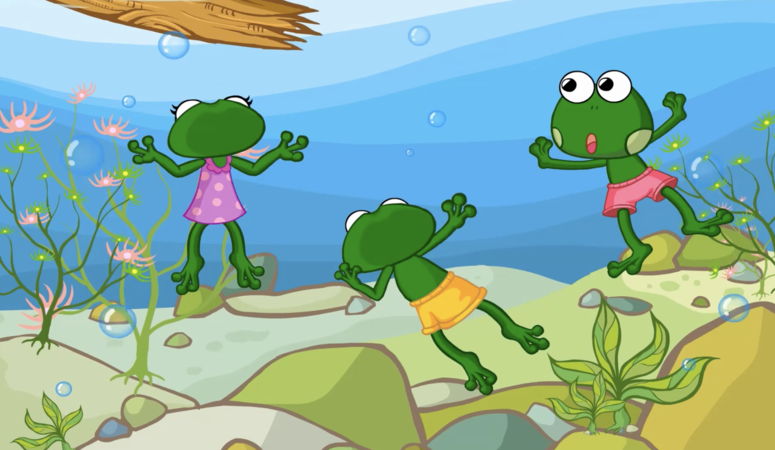

### 於是他們坐在樹幹上，還對它做鬼臉！
> Alors elles s'assirent sur la bûche et lui firent même des grimaces !

### 青蛙們對他們的國王很不滿意。
> Les grenouilles étaient mécontentes de leur roi.

### “多麼傻的國王！我們的國王並不是一個真正的國王。” 
> "Quel roi insensé ! Notre roi n'est pas un vrai roi."

### “其他的動物會戲弄我們的國王。” 
> "Les autres animaux pourraient se moquer de notre roi."

### “讓我們回去找森林之神要一個真正的國王。” 他們討論着說。
> "Retournons trouver le Dieu de la forêt et demandons un vrai roi", discutèrent-elles.

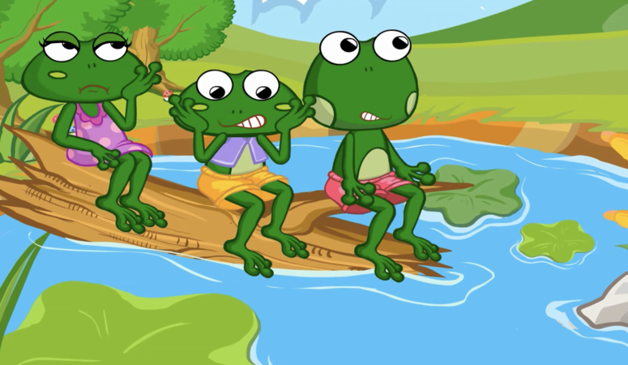

### 於是青蛙們又來到森林之神面前。
> Les grenouilles retournèrent donc voir le Dieu de la forêt.

### “神通廣大的神！請賜給我們一個真正的國王。” 他們請求道。
> "Dieu tout-puissant ! S'il vous plaît, donne-nous un vrai roi", ont-ils demandé.

### 森林之神對此感到很驚訝。
> Le Dieu de la forêt en fut surpris. "Hmm. D'accord, je vais vous donner un autre nouveau roi", annonça-t-il.

### “嗯。好吧，我再給你們一個新的國王。” 他宣佈道。
> Les grenouilles heureuses rentrèrent chez elles pour attendre le nouveau roi. Bientôt, une anguille apparut dans l'étang.

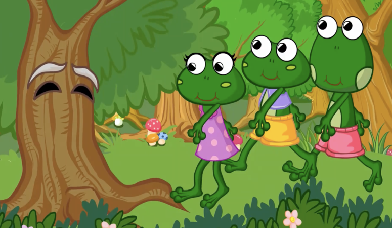

### 快樂的青蛙們回到家裏等待新的國王。很快，一條鰻魚出現在池塘裏。
> Les grenouilles heureuses retournèrent chez elles pour attendre un nouveau roi. Très rapidement, une anguille apparût dans l'étang !

### “你們好！我是你們的新國王。” 他說，“讓我們和睦相處吧。” 
> "Bonjour ! Je suis votre nouveau roi", a-t-il dit. "Entendons-nous bien ensemble."

### “好極了！” 青蛙們很開心。“我們會聽從您的指示。” 
> "Super !" Les grenouilles étaient heureuses. "Nous allons suivre tes instructions."

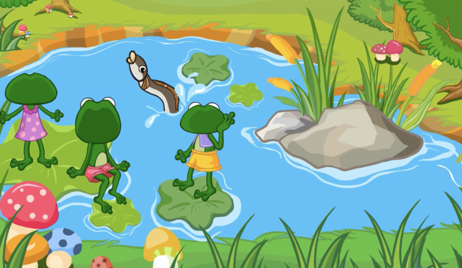

### 但是溫順的鰻魚從來沒有發出任何命令。他只是享受地在池塘裏游來游去。
> Mais l'anguille docile ne donnait jamais d'ordres. Elle aimait juste nager autour de l'étang.

### 於是青蛙們又召開了一次會議。
> Alors les grenouilles convoquèrent une autre réunion.

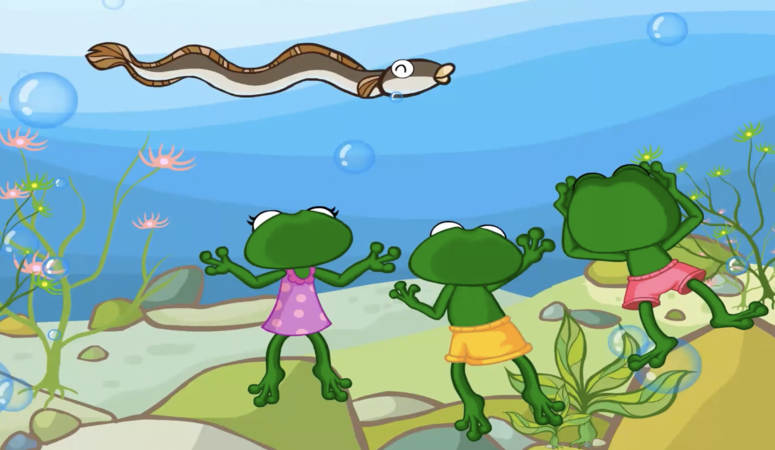

### “這個國王不好。鰻魚作爲一個國王來講太溫厚了。” 
> "Ce roi n'est pas bon. L'anguille a trop bon caractère pour être un roi."

### “你說得對。其他的動物也會嘲笑他。”
> "Ce que vous dites est vrai. Les autres animaux vont se moquer de lui aussi."

### “讓我們再去找森林之神要一個更好的國王。” 他們說。
> "Retournons voir le Dieu de la forêt et demandons un meilleur roi !" dirent-elles.

### 青蛙們再一次找到森林之神。
> Les grenouilles retrouvèrent le Dieu de la forêt.

### “神通廣大的神，請給我們一個更好的國王。” 他們請求道。
> "Dieu tout-puissant, donne-nous un meilleur roi," demandèrent-elles.

### “請賜給我們最強大的國王，不然我們會再回來的。”
> "S'il te plaît, donne-nous le roi le plus fort, ou nous reviendrons sans cesse pour en demander un autre."

### 森林之神很生氣。“我已經給你們派了兩位好國王讓你們能自由地生活。
> Le Dieu de la forêt était en colère. "Je vous ai envoyé deux bons rois qui vous ont laissé vivre librement. 

### 你們卻不知足！好吧，我給你們派一個大的，強壯的國王！” 
> Mais vous n'étiez pas satisfaits ! Très bien, je vais vous envoyer un roi grand et fort !"

### 青蛙們高興地回家等待他們強大的國王。
> Les grenouilles rentrèrent joyeusement chez elles pour attendre leur roi fort.

### “現在其他的動物們不會再嘲笑我們的國王了。” 他們說。
> "Maintenant les autres animaux ne se moqueront plus de notre roi", dirent-ils.

### 很快，森林之神派了蒼鷺到池塘。當青蛙們看到蒼鷺時很高興。
> Bientôt, le Dieu de la forêt envoya un héron à l'étang. Quand les grenouilles virent le héron, elles furent heureuses.

### “哦，看我們的新國王！”
> "Oh, regardez notre nouveau roi !"

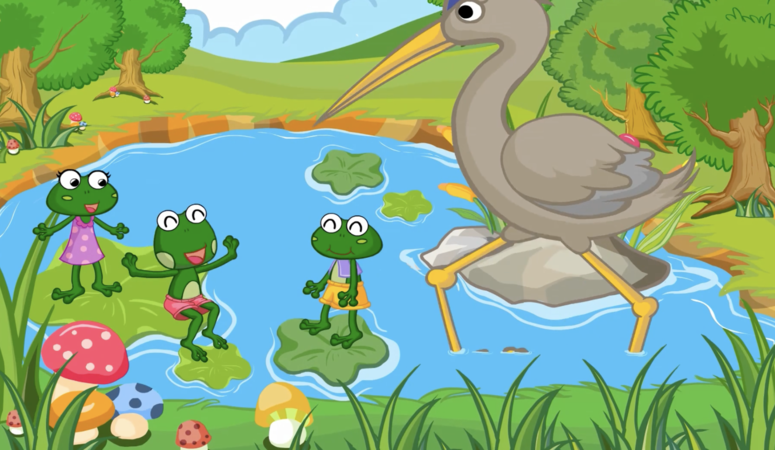

### “他看上去如此高大完美！”
> "Il a l'air si grand et si merveilleux !"

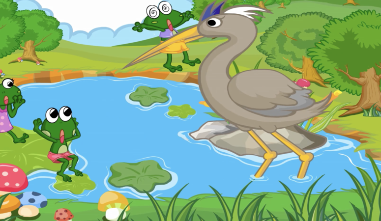

### 但是蒼鷺叼起一隻青蛙吃掉了。
> Mais le héron a ramassé une grenouille et l'a mangée.

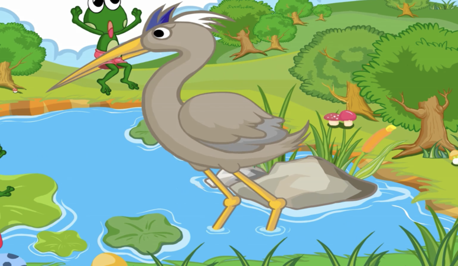

### “天啊！快跑！快跑！” 其他青蛙哭喊道。
> "Oh là là ! Courez ! Cours !" criaient les grenouilles.

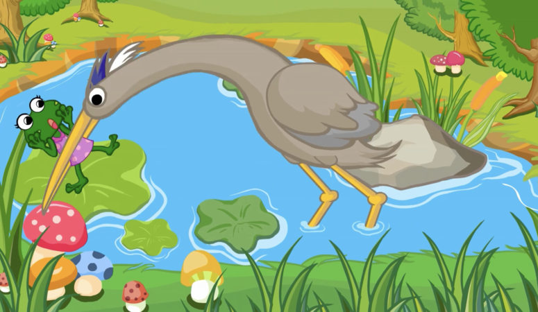

### 但是太遲了。蒼鷺吞下了一隻又一隻的青蛙。池塘裏一隻青蛙都沒有了。
> Mais il était trop tard. Le héron dévora une grenouille après l'autre jusqu'à ce qu'il n'y en ait plus aucune dans l'étang.

### 森林之神看着蒼鷺飛走了。“有的時候，人們應該學會滿足於現在所擁有的。”
> Le Dieu de la forêt regarda le héron s'envoler. "Parfois, les gens devraient apprendre à se satisfaire de ce qu'ils ont."