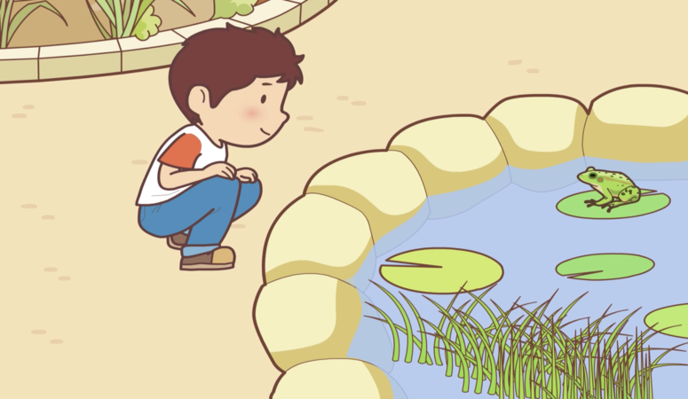
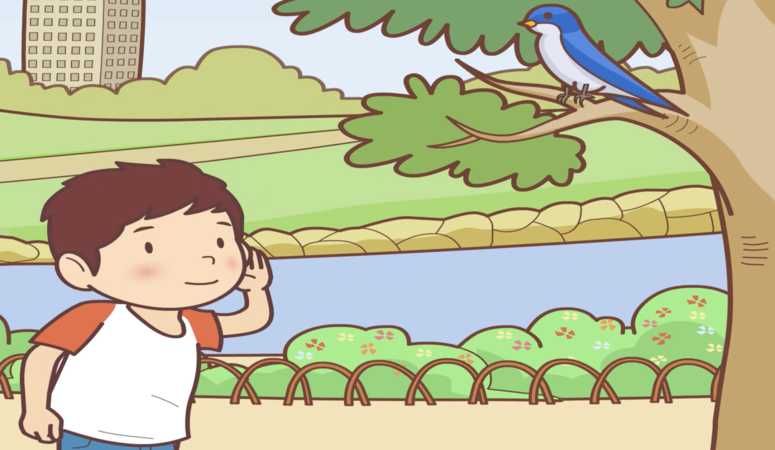
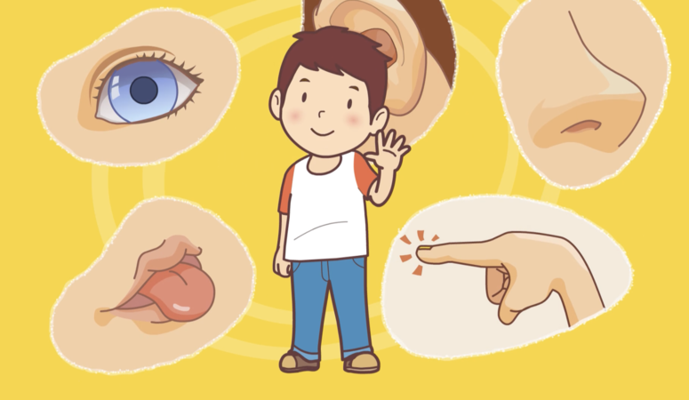

### 我有五種感官。
> Wǒ yǒu wǔ zhǒng gǎnguān.

> J'ai cinq sens.

### 我用眼睛看。
> Wǒ yòng yǎnjing kàn.

> Je regarde avec mes yeux.

### 我看到青蛙。
> Wǒ kàndào qīngwā.

> Je regarde la grenouille.

### 我用耳朵聽。
> Wǒ yòng ěrduo tīng.

> J'entends avec mes oreilles.

### 我聽到鳥叫。
> Wǒ tīngdào niǎo jiào.

> J'entends le cri des oiseaux.

### 我用鼻子聞。
> Wǒ yòng bízi wén.

> Je sens avec mon nez.

### 我聞到玫瑰花香。
> Wǒ wéndào méiguīhuā xiāng.

> Je sens le parfum des roses.

### 我用舌頭嘗。
> Wǒ yòng shétou cháng.

> Je goûte avec ma langue.

### 我嚐到糖果的味道。
> Wǒ chángdào tángguǒ de wèidao.

> Je goûte la saveur du bonbon.

### 我用手摸。
> Wǒ yòng shǒu mō.

> Je touche avec ma main.

### 我摸到冰。
> Wǒ mōdào bīng.

> Je touche de la glace.

### 不管我做什麼，我都用到五種感官。
> Bùguǎn wǒ zuò shénme, wǒ dōu yòngdào wǔ zhǒng gǎnguān.

> Quoi que je fasse, j'utilise mes cinq sens.