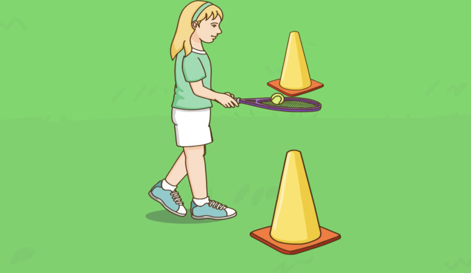
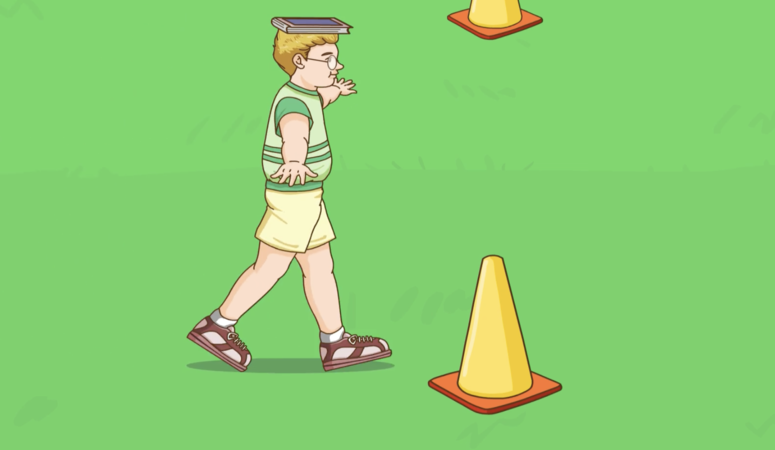
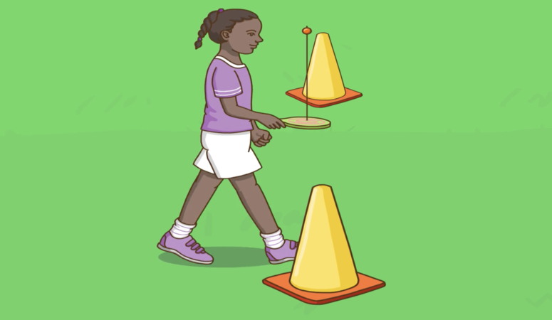

### 她是第一個。
> Tā shì dì yī ge.

> Elle est la première.

### 他是第二個。
> Tā shì dì èr ge.

> Il est le second.

### 她是第三個。
> Tā shì dì sān ge.

> Elle est la troisième.

### 他是第四個。
> Tā shì dì sì ge.

> Il est le quatrième.

### 他是第五個。
> Tā shì dì wǔ ge.

> Il est le cinquième.

### 她是第六個。
> Tā shì dì liù ge.

> Elle est la sixième.

### 他是第七個。
> Tā shì dì qī ge.

>  Il est le septième.

### 她是第八個。
> Tā shì dì bā ge.

> Elle est la huitième.

### 她是第九個。
> Tā shì dì jiǔ ge.

> Elle est la neuvième.

### 我是第十個。
> Wǒ shì dì shí ge.

> Je suis la dixième.

### 我的隊伍真棒！
> Wǒ de duìwu zhēn bàng !

> Mon équipe est super !